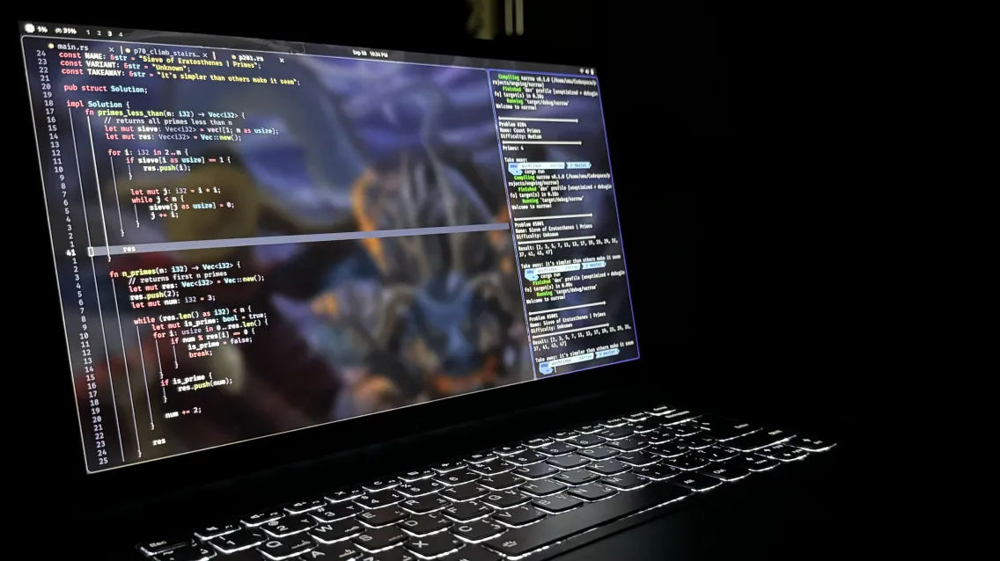
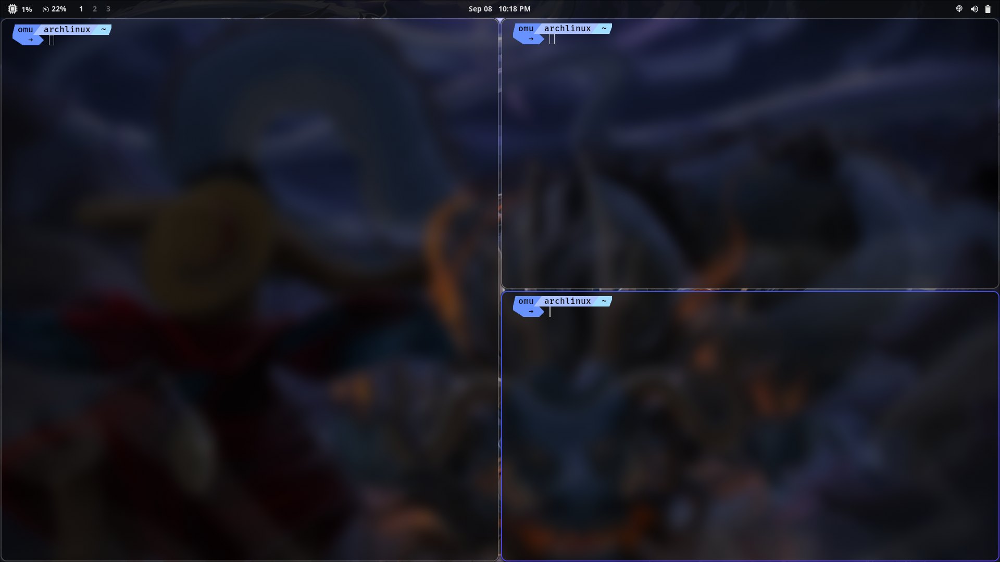
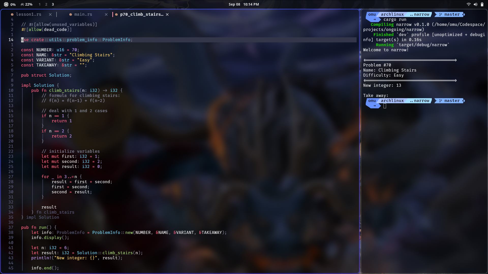
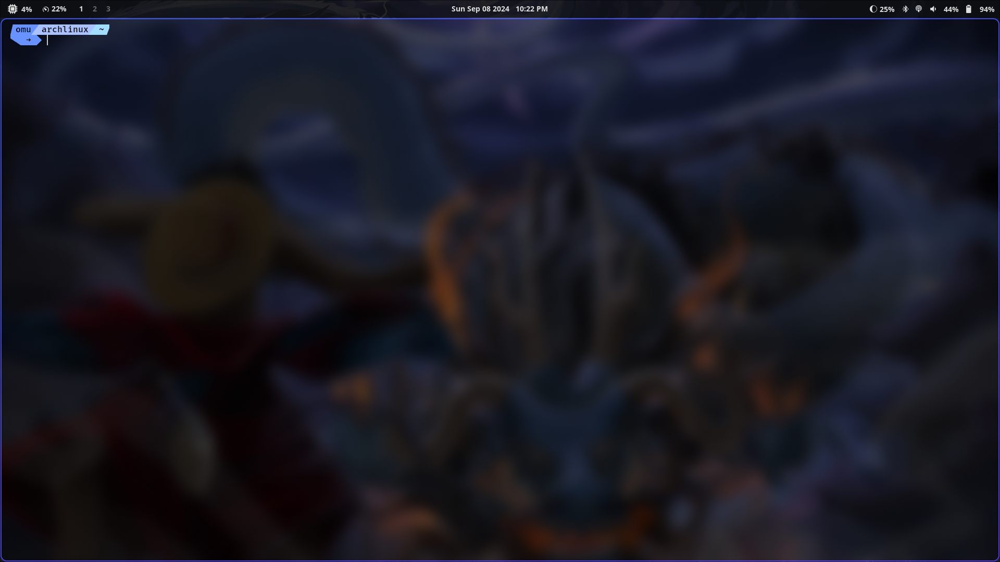
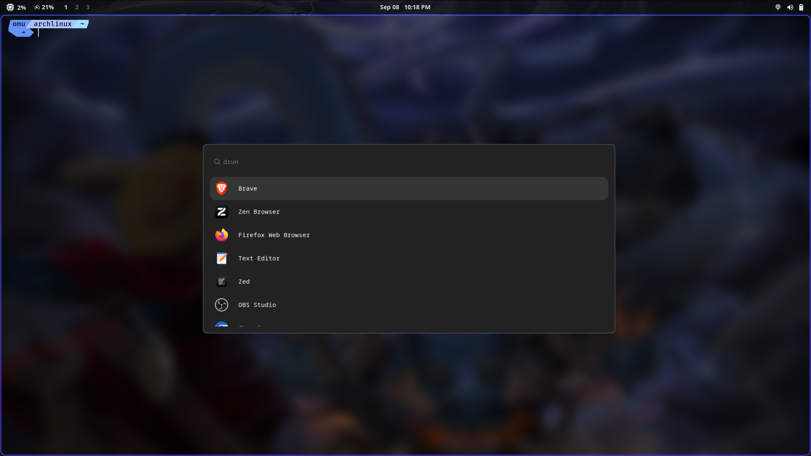

# My dotfiles

These are the dotfiles that I use in my daily workflow. I change settings and configurations whenever I find something new that works better so this repo will see updates frequently. Check out the sample images below, if there's anything you like feel free to grab the dotfiles.

### Plug

Check out my [website](link) for more info

### Tooling

- [Hyprland](link) for window tiling
- [hyprpaper](link) for wallpaper
- [kitty](link) for terminal emulator
- [waybar](link) for status bar
- [wofi](link) for search application functionality
- [Nerd Font](link) for aesthetics
- [starship](link) for terminal aesthetics
- [Neovim](link) for software development
- [wallpaper](assets/wallpaper/luffy-kaido.jpg) (or find one [here](https://github.com/MosesDVarghese/Wallpapers))

### Sample Images

Kitty

Desc

Neovim

Desc

Waybar

I prefer GNOME's minimalistic status bar and have tried to replicate it with Waybar. But whenever I do need more info I can click on icons which will reveal its expanded view.

Wofi

Wofi has been modified to have a more smooth look (rounded corners and dark color scheme) than what it ships with by default.

### Contact

Desc
